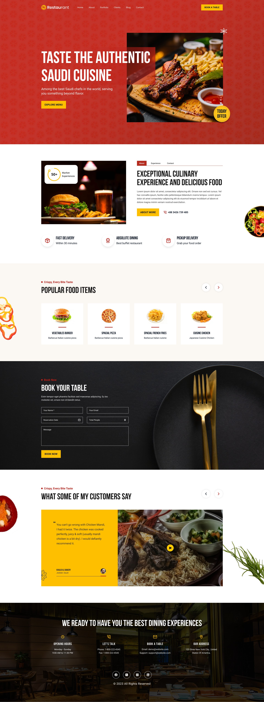
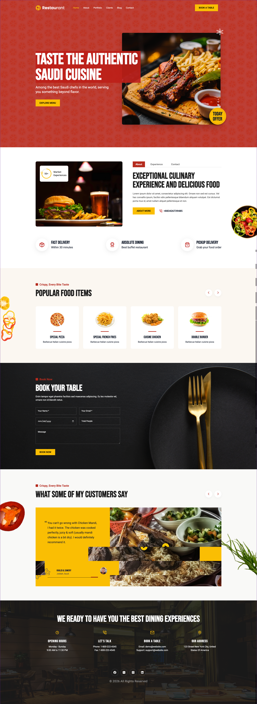
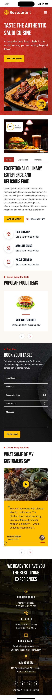
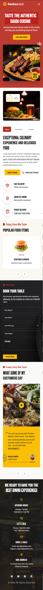

# Restaurant - Authentic Saudi Cuisine

A modern, responsive, and visually appealing landing page for a premium Saudi cuisine restaurant. This project is built using HTML, CSS, and Vanilla JavaScript, featuring a dynamic user interface with interactive elements and smooth animations.

## 🌟 Features

-   **Fully Responsive Design:** Seamlessly adapts to all screen sizes, from mobile phones to large desktop displays.
-   **Interactive Navigation:** A sleek, sticky header that changes style on scroll, complete with a mobile-friendly hamburger menu.
-   **Dynamic Tab Navigation:** Effortlessly switch between "About," "Experience," and "Contact" sections without page reloads.
-   **Swiper Carousels:** Utilizes Swiper.js to beautifully display popular dishes and customer testimonials.
-   **Animated Progress Indicators:** Custom animations for the testimonial slider to visually indicate auto-play progress.
-   **Table Booking Form:** A functional front-end booking form with basic interaction.
-   **Modern Typography & Styling:** Uses Google Fonts (Poppins) and custom CSS variables for a consistent, premium look.

**Live Link:** https://resturant-bss.vercel.app/

## 📸 Screenshots

### Desktop View

  

### Mobile View

  
  

